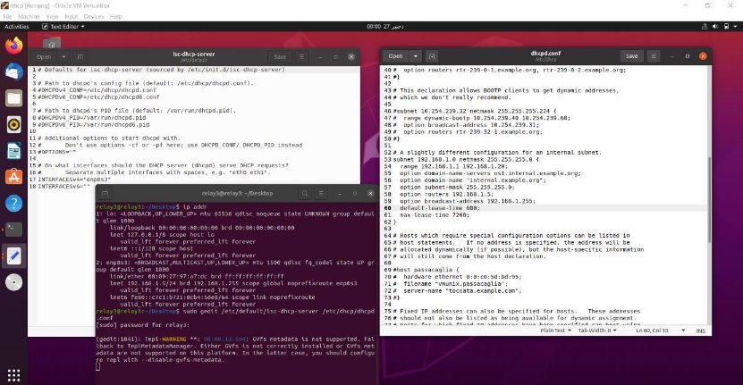

`  `Rapport  du TP2

Attaques actives 

REALISER PAR : 

` `ZINEB EL RHAZOUANI  SAID EL OUARDI  ADIL ERRAD 

1. Introduction……………………………………………………………..1  
   1. Objectif du TP…………………………………………………………1.1 
2. Implémentation d’attaques actives…………………………...2  
2. Test de quelques outils d’attaques……………………………..3 

A. Attaque DHCP starvation…………………………………………….a.3 

2. Attaque “Man In The Middle” basée sur l'attaque “ARP        

spoofing”………………………………………………………………………………….b.3 

3. Attaque “usurpation d’identité”…………………………………...c.3 
3. Attaque “ARP cache poisoning”……………………………………d.3 
3. Attaque « Inondation de la table de commutation »…….e.3 

Introduction : 

Les attaques actives sont mises en place par l’injection, la modification ou la suppression de paquets. L’attaquant peut ainsi laisser les traces des attaques qu’il lance. Ces traces peuvent être exploitées par l’administrateur réseau pour déceler l’existence d’attaques et identifier l’attaquant si possible. 

v Objectifs de ce TP: 

- Implémenter quelques attaques et les tester. 
  - Mise en place de quelques attaques en 

utilisant des outils d’attaques. 

Implémentation d’attaques actives          Exercice 1 : my\_ping.c 

Exercice 2 : pingsur2frag.c 

Exercice 3 : pingfragments.c 

Exercice 4 : demandeconntcp.c 

Test de quelques outils d’attaques 

A. Attaque DHCP starvation 

DHCP starvation : L’attaquant inonde le serveur DHCP avec des messages DHCPREQUEST afin de réserver toutes les adresses IP disponibles sur le serveur DHCP. L’attaquant doit utiliser une nouvelle adresse MAC pour chaque requête. 

- installer des utilitaires pour dhcpstarv (Install utils for dhcpstarv).

- Install dhcpstarv 

- Configuration DHCP 
- Status DHCP  

- Test DHCP 

- Lance l’attaque 

- dossier de bail avant l’attaque (lease file 

before the attack) 

- dossier de bail avant l’attaque (lease file before the attack) 

- Result 

2. Attaque “Man In The Middle” basée sur l'attaque “ARP        

spoofing ”  .    

- Etape 1 

- Etape2.1 

- Etape2.2 

- Etape3 

3. Attaque “usurpation d’identité” 
- Etape1 : configure mac adresse 

- etape2 : configure adresse IP 

- Etape3 : send echo request 

- Etape4 : send echo reply 

- Etape 5 : Echo reply last package 

4. Attaque “ARP cache poisoning”
- etape1 :Vérifier  la connectivite 

- Etape2 :Arp 

- Etape3  

- Etape 4 

- Etape 5 

5. Attaque « Inondation de la table de commutation » 
- Etape1 : adresse IP 

- Etape1.2 : test ping 

- 2.1 install arpflood 

- Test ping with arpflood 

- Install vsftpd 

- Add user in vsftpd 

- Configuration vsftpd 

- configuration vsftpd-add user 

- configuration vsftpd  server 

- Retrouver sur la troisième machine les trames correspondant 

